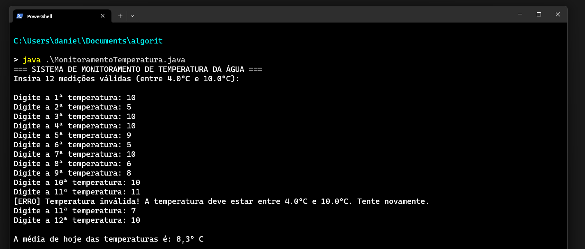

# Algoritmo - Exercício Java: Monitoramento de Temperatura

  

## Contextualização

A temperatura da água é um fator crucial em operações de resgate. Após o colapso de uma ponte na cidade de Baltimore (EUA), equipes de busca trabalharam em águas com temperaturas entre **7 °C e 8 °C**. 

Segundo o *Serviço Meteorológico Nacional americano* e a *Universidade de Minnesota*, o tempo de sobrevivência sem equipamentos de flutuação nessas condições varia de **30 a 60 minutos**.

**Fonte:** [CNN Brasil](https://www.cnnbrasil.com.br/internacional/temperatura-da-agua-e-crucial-para-resgate-apos-navio-derrubar-ponte-nos-eua/)

---

## Desafio de Negócio

  

Você foi contratado(a) pela empresa **Paiva Ltda.** para desenvolver uma solução em **Java** voltada ao monitoramento ambiental.

Sua missão é criar um algoritmo que colete e valide as medições diárias de temperatura da água de uma determinada região.

### Requisitos do Sistema

1. O algoritmo deve ler **12 temperaturas** ao longo de um dia.
2. Cada temperatura deve estar estritamente no intervalo entre **4 ºC e 10 ºC** (inclusive).
3. **Validação de Entrada:** Se o valor digitado for menor que 4 ºC ou maior que 10 ºC, o sistema deve exibir uma mensagem de alerta e **solicitar a entrada novamente**.
4. Apenas temperaturas válidas devem fazer parte do cálculo.
5. Ao final, o programa deve calcular e imprimir a **média aritmética** das 12 temperaturas aferidas.

---

## Análise e Cenários de Teste

Para auxiliar no desenvolvimento, o analista de sistemas mapeou dois cenários de teste:

### 1º Cenário (Valores Constantes)

Todas as 12 temperaturas inseridas foram **10 ºC**.

Saída esperada do programa:

~~~text
A média de hoje das temperaturas é: 10,0 ºC
~~~

### 2º Cenário (Valores Variados com Validação)

A entrada dos dados respeita o seguinte fluxo:

  

Saída esperada do programa:

~~~text
A média de hoje das temperaturas é: 8,3 ºC
~~~

---

## Ferramentas e Requisitos Técnicos

* **Linguagem:** Java (utilize uma versão LTS, como Java 17 ou 21).
* **IDE:** Desenvolva na IDE de sua preferência (VS Code, IntelliJ, Eclipse, NetBeans).
* **Entrega:**
  1. Faça o `fork` deste repositório para sua conta no GitHub.
  2. Desenvolva o algoritmo e faça o `commit`/`push` da solução.
  3. Envie o link do seu repositório na plataforma de entregas.

---

## Observações

Este exercício demonstra a aplicação prática de algoritmos em problemas reais de engenharia e salvamento. Lembre-se de testar seu código com diferentes cenários antes da submissão final.
